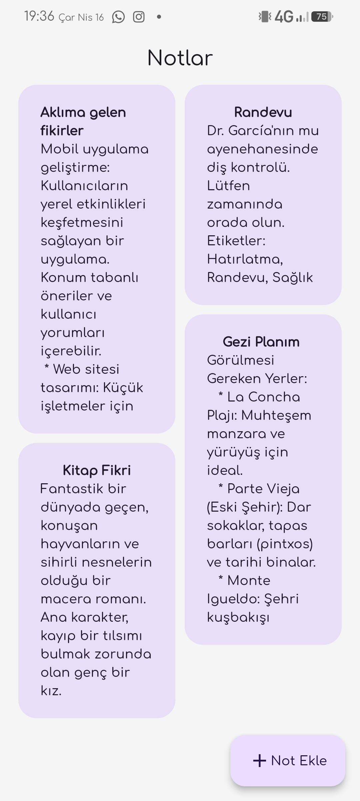

# Note App 📝

This is a simple **note app** made with **Flutter**.  
It helps you save different kinds of notes like ideas, appointments, plans, and more — all in a clean and easy-to-use design.

## ✨ Features

- Add and view notes  
- Each note has a title and content  
- Different types of notes (ideas, plans, appointments, etc.)  
- Nice and modern UI  
- Button to add a new note  

## 📱 Screenshot

  
    &nbsp;
  

## 🛠️ Technologies

- Flutter  
- Dart

## 👨‍💻 Developer

**Mehmet Emin Güler**  
📧 Email: [mhmt.eminguler@gmail.com](mailto:mhmt.eminguler@gmail.com)  
💻 GitHub: [github.com/meminglr](https://github.com/meminglr)
